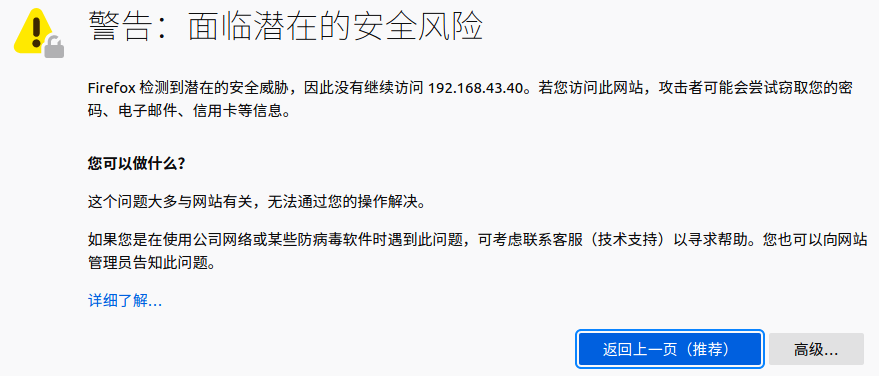
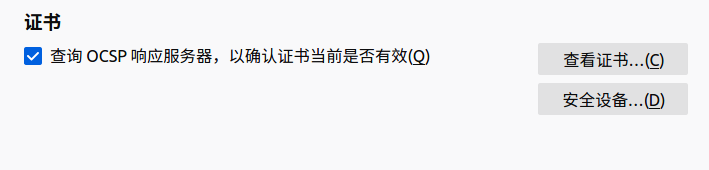
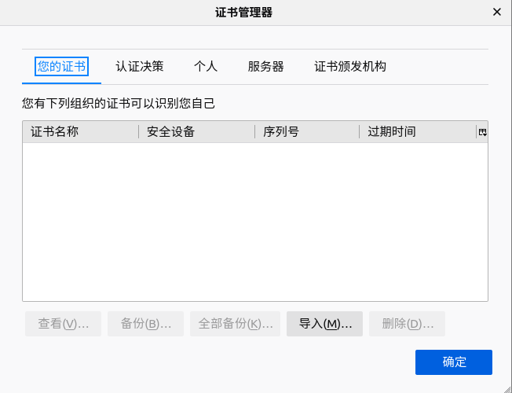
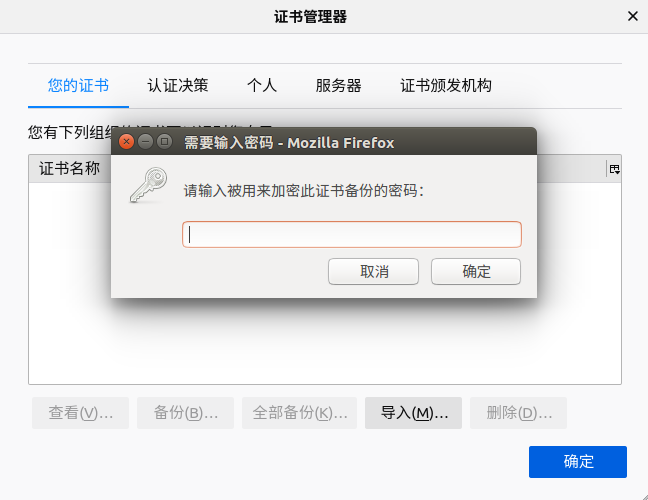
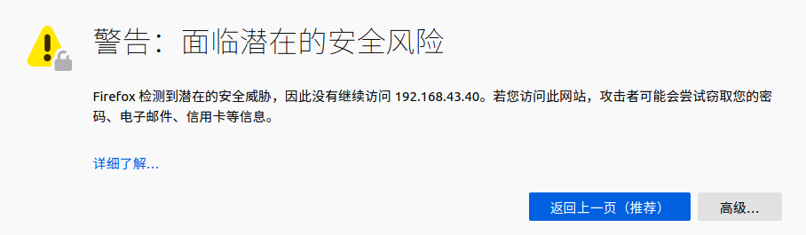
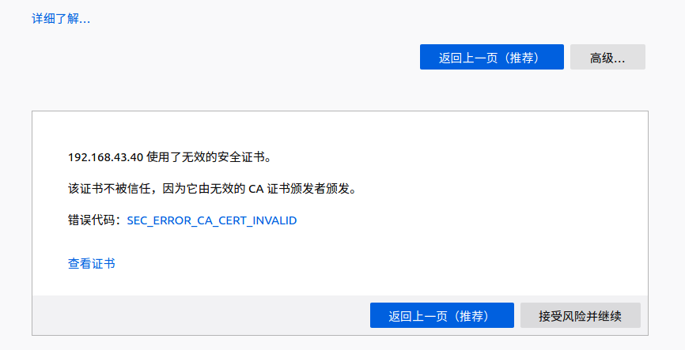
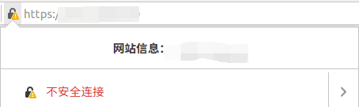
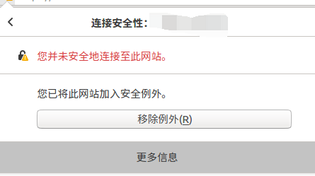
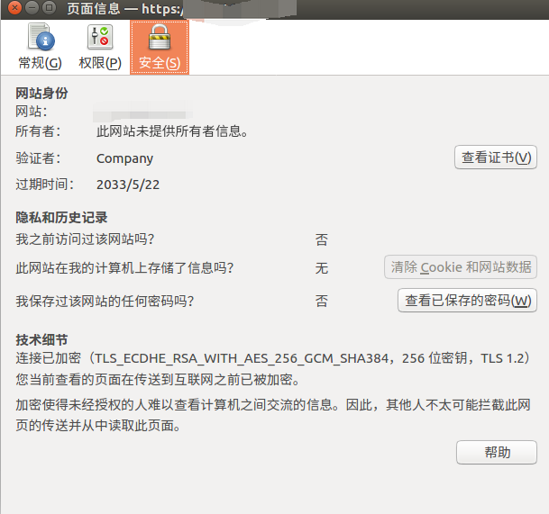
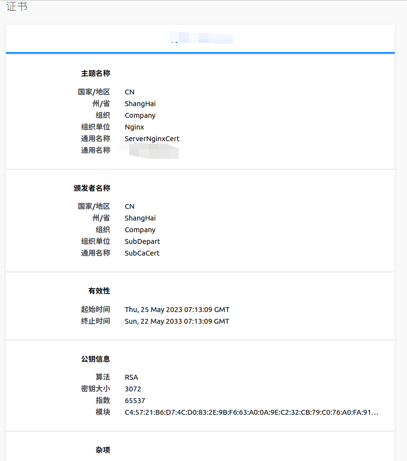

为了测试这一项，可以在测试环境上搭建一个 nginx 代理服务(注意需要支持 ssl 模块)，此步骤略。

前置项:
- ca 服务。这里使用前面几节搭建好的次级 ca 服务。
- nginx 代理服务(需支持 ssl)。此步骤略。

在 /home/pki/nginx 目录下操作。

```s
  mkdir /home/pki/nginx && cd /home/pki/nginx
```

### 签发证书

创建密钥及证书请求csr
```s
  openssl req -newkey rsa:3072 -out server.nginx.csr.pem -keyout server.nginx.pvk.pem -nodes -subj "/C=CN/ST=ShangHai/L=Auto/O=Company/OU=Nginx/CN=ServerNginxCert/CN=192.168.43.40"
```
注意: CN 项必须是服务网站的 ip 地址或 DNS 域名地址，否则在访问时会出现如下类似错误:
```s
  firefox: 警告：面临潜在的安全风险 ...
  ie: 此网站的安全证书存在问题。...
```

将 server.nginx.csr.pem 发送给 ca 服务，请求签发证书(此步骤在 ca 服务器上进行)。
```s
  openssl ca -in server.nginx.csr.pem -out server.nginx.cert.pem -days 3650
```

### nginx 服务器配置

将上面生成的密钥和证书放置到 nginx 服务器上与 nginx.conf 同级目录中去，这里是 `/usr/local/nginx/conf/`。

修改 nginx.conf 配置，将下面的配置内容取消注释，并填写相应的服务器证书和密钥文件名称。
```js
  # HTTPS server
  #
  server {
    listen       443 ssl;
    server_name  localhost;

    ssl_certificate      server.nginx.cert.pem;
    ssl_certificate_key  server.nginx.pvk.pem;

    ssl_session_cache    shared:SSL:1m;
    ssl_session_timeout  5m;

    ssl_ciphers  HIGH:!aNULL:!MD5;
    ssl_prefer_server_ciphers  on;

    location / {
      root   html;
      index  index.html index.htm;
    }
  }
```

重启 nginx 
```s
	nginx -s stop
	nginx
```

### 安装证书

在浏览器上输入 https://xxx.xxx.xxx.xxx:443 可能无法访问，如下:



这是因为还需要在浏览器上安装 rootca 和 subca 证书。

创建 rootca 的 pfx 证书
```s
  cd /home/pki/CA
  openssl pkcs12 -export -out rootca.pfx -inkey private/cakey.pem -in cacert.pem
```

创建 subca 的 pfx 证书
```s
  cd /home/pki/tls/demoCA
  openssl pkcs12 -export -out subca.pfx -inkey private/cakey.pem -in cacert.pem
```

上面虽然生成了两种 .pfx 证书，但实际上应该只需要安装次级 ca 证书 subca.pfx 就可以了。

这里以 firefox 浏览器上的安装为例。

在浏览器地址栏中输入 `about:preferences#privacy`，按回车，找到如下选项按钮:



点击 '查看证书'，弹出 '证书管理器' 对话框，选择 '您的证书' 页签:



点击 '导入' 按钮，找到 subca.pfx 文件。找到后点选 '打开':



输入口令后 '确认' '确定'。

### 访问

操作完毕后，重新打开浏览器。在地址框中输入 `https://xxx.xxx.xxx.xxx:443`，这时页面可能会如下显示:



点击 '高级'，会展开如下信息:



可以看到，只是 ca 证书不被信任，并不是无法认证。

点击 '接受风险并继续' 就可以了。


### 确认生效

那如何确认安装的证书已经生效了呢？

可以点击浏览器地址栏上的如下小锁:



点击弹出的下拉框中右下角的 > 箭头:



点击 '更多信息'，弹出如下对话框:



点击 '查看证书' 按钮:



就可以看到证书了。

因为要在 windows 环境下使用浏览器访问 nginx 服务，所以需要将 rootca subca 证书安装到 windows 上

### windows 环境下安装 rootca 和 subca

1. 将 cacert.pem 和 subca.cert.pem 导出，将名称分别改为 cacert.crt 和 subca.crt

2. 点击安装 cacert.crt，在`证书导入向导`中选择`<将所有的证书放入下列存储>`，点击<浏览>按钮，在`选择证书存储`对话框中选择`受信任的根证书颁发机构`。

3. 点击安装 subca.crt，在`证书导入向导`中选择`<将所有的证书放入下列存储>`，点击<浏览>按钮，在`选择证书存储`对话框中选择`中级证书颁发机构`。

### 问题

1. 执行 nginx -s reload ，重新加载配置启动报下面的错误

```s
  nginx: [emerg] the "ssl" parameter requires ngx_http_ssl_module in /usr/local/nginx/conf/nginx.conf:99
```
原因: nginx 安装时没有安装该模块。

2. 签发证书时报错

```s
	...
	failed to update database
	TXT_DB error number 2
```

解决: 删除 /etc/pki/CA 下的 index 文件，重新 touch
